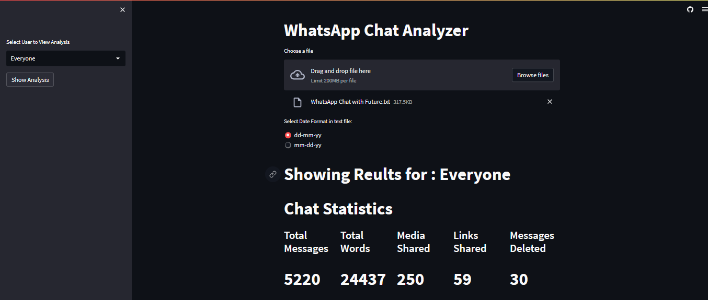

# WhatsApp Chat Analyzer

This repository contains the **WhatsApp Chat Analyzer** project, a tool that allows you to analyze and extract insights from WhatsApp chat exports. The project is developed by [Karan Prasad Gupta](https://github.com/karanprasadgupta), [Narayan Jha](https://github.com/kyayaarnarayan), and is written in Python.

## Table of Contents

- [Introduction](#introduction)
- [Demo](#demo)
- [Features](#features)
- [Installation](#installation)
- [Usage](#usage)
- [Examples](#examples)

## Introduction

The **WhatsApp Chat Analyzer** is designed to help you gain valuable insights from your WhatsApp chats. It provides various functionalities to analyze and visualize data extracted from the chat exports. This tool allows you to explore patterns, trends, and statistics related to your conversations, helping you understand your messaging behavior and communication patterns.

The project utilizes various open-source libraries and tools. See the [`requirements.txt`](https://github.com/karanprasadgupta/WhatsAppChatAnalzyer/blob/main/requirements.txt) file for details.

## Demo

> *If the website does not load properly, try opening it in incognito mode.*

## Features

- **Chat Data Extraction**: The analyzer can extract relevant information from WhatsApp chat exports, including message timestamps, senders, and message content.
- **Participant Analysis**: Gain insights into individual participants' activity, such as message count, average message length, and active hours.
- **Chat Statistics**: Get an overview of chat statistics, including total messages, media messages, and the most active day and time.
- **Word Cloud Generation**: Generate word clouds to visualize frequently used words in the chat.
- **Emoji Analysis**: Analyze the usage of emojis in the chat and generate insights about the most commonly used emojis.
- **Interactive Visualization**: Utilize interactive plots and graphs to visualize data and patterns.
